# AI 对岗位与裁员风险影响最终数据分析报告

报告日期：2026-06-07  
数据文件：`ai-impact-jobs-layoff-risk-dataset.csv`  
分析来源：`ai_impact_jobs_layoff_risk_analysis.ipynb`  
目标变量：`Layoff_Risk`，包含 `Low`、`Medium`、`High` 三类

## 1. 执行摘要

本次分析基于 20,000 条岗位样本，覆盖人口背景、职业属性、任务结构、AI 使用情况和裁员风险等级。整体看，裁员高风险并不是由单一因素决定，而是由“高重复性任务、高任务自动化比例、高 AI 采用/使用强度、低创造力要求、较低岗位级别”等因素共同叠加形成。

核心结论如下：

1. `Layoff_Risk` 三类分布基本均衡：`Low` 33.0%，`Medium` 33.0%，`High` 34.0%，适合开展多分类建模。
2. 高风险行业集中在 `Manufacturing`、`Logistics`、`Retail`，高风险比例分别为 48.2%、41.5%、40.7%。
3. 高风险岗位集中在 `Operator`、`Production Supervisor`、`Quality Engineer`、`Inventory Analyst`、`Dispatcher`，高风险比例分别为 50.2%、48.3%、46.0%、44.6%、42.1%。
4. AI 采用等级与高风险比例高度相关：`AI_Adoption_Level = High` 的高风险比例为 80.8%，`Medium` 为 58.2%，`Low` 为 9.2%。
5. 岗位级别具有明显风险缓冲作用：`Entry` 高风险比例为 44.5%，`Mid` 为 30.7%，`Senior` 为 11.5%。
6. 高风险样本的重复性任务比例、任务自动化比例、AI 使用强度显著更高；创造力要求和人类能力保护指数显著更低。
7. 最佳多分类模型为 Logistic Regression，测试集 Accuracy = 0.962，Macro F1 = 0.962。
8. 最佳二分类高风险预警模型为 Logistic Regression，High Recall = 0.982，PR-AUC = 0.997，适合用于高风险样本筛查。
9. 模型解释结果显示，最关键的影响因素包括 `Routine_Task_Percentage`、`Tasks_Automated_Percentage`、`Job_Level_Score`、`Industry`、`Education_Score`、`Human_Creative_Protection_Index`、`Automation_Exposure_Index` 和 `Creativity_Requirement`。
10. 无监督聚类识别出一个明显的高风险群体：Cluster 0 高风险比例为 62.8%，其特征是高自动化暴露、低创造力互动保护、高 AI 使用强度。

需要注意：本数据为观察型数据。统计相关性、模型特征重要性和 SHAP 解释不能直接等同于严格因果关系，实际业务应用中应结合组织战略、岗位调整计划、绩效、团队结构和人工复核。

## 2. 数据概况

### 2.1 数据规模与字段

数据集共有 20,000 行、16 列。字段覆盖以下维度：

| 维度 | 字段 |
|---|---|
| 人口与职业背景 | `Age`、`Education_Level`、`Years_of_Experience` |
| 岗位与组织特征 | `Industry`、`Job_Role`、`Company_Size`、`Job_Level` |
| 工作任务属性 | `Routine_Task_Percentage`、`Creativity_Requirement`、`Human_Interaction_Level` |
| AI 使用与自动化 | `AI_Adoption_Level`、`Number_of_AI_Tools_Used`、`AI_Usage_Hours_Per_Week`、`Tasks_Automated_Percentage`、`AI_Training_Hours` |
| 目标变量 | `Layoff_Risk` |

### 2.2 数据质量

Notebook 对缺失值、重复记录、数值范围和类别一致性进行了检查，结果如下：

| 检查项 | 结果 |
|---|---:|
| 样本量 | 20,000 |
| 字段数 | 16 |
| 重复记录 | 0 |
| 存在缺失值的字段数 | 0 |
| 缺失值总数 | 0 |
| 年龄范围异常 | 0 |
| 工作经验为负 | 0 |
| 工作经验与年龄逻辑冲突 | 0 |
| 百分比字段越界 | 0 |
| 类别字段异常值 | 0 |

结论：数据质量良好，可直接进入描述性分析、统计检验和预测建模。

## 3. 描述性分析

### 3.1 数值变量概览

| 指标 | 均值 | 中位数 | 最小值 | 最大值 |
|---|---:|---:|---:|---:|
| Age | 40.4 | 40.0 | 21.0 | 60.0 |
| Years_of_Experience | 7.3 | 7.0 | 0.0 | 32.0 |
| Routine_Task_Percentage | 51.9 | 52.0 | 10.0 | 94.0 |
| Creativity_Requirement | 47.8 | 48.0 | 0.0 | 100.0 |
| Human_Interaction_Level | 60.1 | 62.0 | 20.0 | 99.0 |
| Number_of_AI_Tools_Used | 2.5 | 2.0 | 0.0 | 10.0 |
| AI_Usage_Hours_Per_Week | 6.8 | 5.0 | 0.0 | 30.0 |
| Tasks_Automated_Percentage | 37.2 | 35.0 | 4.0 | 93.0 |
| AI_Training_Hours | 12.6 | 8.0 | 0.0 | 79.0 |

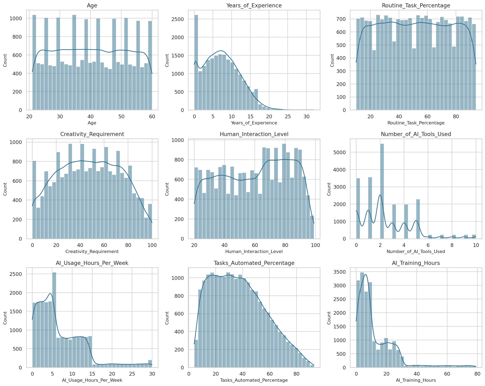

### 3.2 类别变量分布

主要类别分布特征：

- 教育水平以 `Bachelor's` 为主，占 49.8%；其次为 `Master's`，占 27.1%。
- 行业分布较均衡，8 个行业占比均约 12% 到 13%。
- 公司规模以 `Medium` 为主，占 44.8%；`Small` 占 30.3%；`Large` 占 24.8%。
- 岗位级别以 `Entry` 和 `Mid` 为主，分别占 45.1% 和 39.7%；`Senior` 占 15.2%。
- AI 采用等级中 `Low` 占 52.7%，`Medium` 占 40.2%，`High` 占 7.1%。

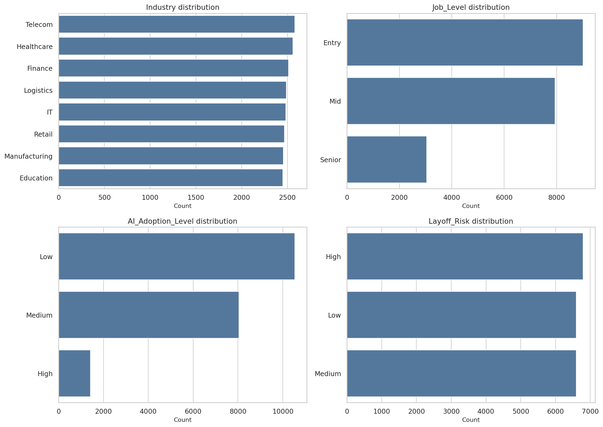

### 3.3 目标变量分布

| 风险等级 | 样本数 | 占比 |
|---|---:|---:|
| Low | 6,602 | 33.0% |
| Medium | 6,601 | 33.0% |
| High | 6,797 | 34.0% |

目标变量三类分布基本均衡，后续模型无需进行强类别不平衡处理。

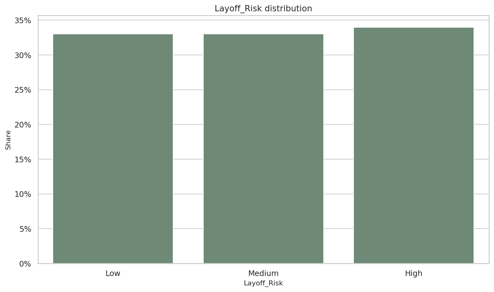

## 4. 裁员风险差异分析

### 4.1 行业与裁员风险

不同行业的高风险比例差异明显。

| 行业 | 样本数 | 高风险比例 |
|---|---:|---:|
| Manufacturing | 2,457 | 48.2% |
| Logistics | 2,488 | 41.5% |
| Retail | 2,467 | 40.7% |
| Finance | 2,513 | 37.7% |
| Telecom | 2,582 | 35.2% |
| IT | 2,483 | 28.0% |
| Healthcare | 2,561 | 20.8% |
| Education | 2,449 | 20.1% |

制造、物流、零售的高风险比例最高，说明这些行业中的岗位任务更可能具备重复性强、流程标准化程度高、可自动化空间大的特征。教育和医疗健康行业的高风险比例相对较低，可能与其更高的人际互动、专业判断和服务情境复杂性有关。

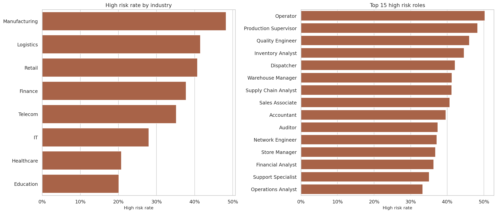

### 4.2 岗位角色与裁员风险

| 岗位 | 样本数 | 高风险比例 |
|---|---:|---:|
| Operator | 858 | 50.2% |
| Production Supervisor | 806 | 48.3% |
| Quality Engineer | 793 | 46.0% |
| Inventory Analyst | 857 | 44.6% |
| Dispatcher | 788 | 42.1% |
| Warehouse Manager | 843 | 41.3% |
| Supply Chain Analyst | 857 | 41.2% |
| Sales Associate | 807 | 40.6% |
| Teacher | 812 | 16.4% |
| Nurse | 900 | 16.7% |

高风险岗位多集中在制造、物流、零售及运营流程相关角色；低风险岗位主要集中在教育、医疗等高人际互动和专业服务场景。

### 4.3 AI 采用等级与裁员风险

| AI 采用等级 | 样本数 | Low | Medium | High |
|---|---:|---:|---:|---:|
| High | 1,415 | 1.2% | 18.0% | 80.8% |
| Medium | 8,046 | 8.3% | 33.6% | 58.2% |
| Low | 10,539 | 56.2% | 34.6% | 9.2% |

AI 采用等级与裁员高风险高度相关。AI 采用程度越高，高风险比例越高。但该结果不能简单解释为“AI 采用导致裁员风险上升”；更合理的解释是：AI 更容易优先进入可标准化、可自动化、重复性高的岗位场景，而这些岗位本身也更容易面临调整压力。

### 4.4 岗位级别与裁员风险

| 岗位级别 | 样本数 | Low | Medium | High |
|---|---:|---:|---:|---:|
| Entry | 9,016 | 22.8% | 32.7% | 44.5% |
| Mid | 7,940 | 35.2% | 34.2% | 30.7% |
| Senior | 3,044 | 57.7% | 30.8% | 11.5% |

岗位级别具有明显保护作用。高级岗位通常包含更多复杂判断、跨团队协作、流程设计和责任承担，这些任务较难被直接自动化替代。

### 4.5 教育水平与裁员风险

| 教育水平 | 样本数 | 高风险比例 |
|---|---:|---:|
| High School | 3,558 | 45.6% |
| Bachelor's | 9,967 | 35.1% |
| Master's | 5,426 | 27.1% |
| PhD | 1,049 | 20.1% |

教育水平越高，高风险比例整体越低。这可能反映了高教育水平岗位更偏向复杂认知、专业判断、研究或管理性质，但该关系仍需结合行业和岗位结构共同解释。

### 4.6 数值变量与风险等级

高风险组与低风险组在核心任务和 AI 变量上差异显著。

| 指标 | Low 均值 | Medium 均值 | High 均值 |
|---|---:|---:|---:|
| Routine_Task_Percentage | 28.5 | 51.3 | 75.2 |
| Tasks_Automated_Percentage | 19.5 | 35.7 | 56.0 |
| Creativity_Requirement | 71.9 | 48.3 | 23.8 |
| Human_Interaction_Level | 64.6 | 59.7 | 55.9 |
| Number_of_AI_Tools_Used | 1.3 | 2.3 | 3.8 |
| AI_Usage_Hours_Per_Week | 3.3 | 6.2 | 10.8 |
| AI_Training_Hours | 6.0 | 11.4 | 20.2 |
| Years_of_Experience | 7.9 | 7.3 | 6.7 |

关键解读：

- 高风险组的重复性任务比例均值为 75.2，显著高于低风险组的 28.5。
- 高风险组的任务自动化比例均值为 56.0，显著高于低风险组的 19.5。
- 高风险组的创造力要求均值为 23.8，显著低于低风险组的 71.9。
- 高风险组 AI 培训小时数更高，这更可能反映高风险岗位已经处于自动化转型或补救培训过程中，不能直接解释为“培训提高裁员风险”。

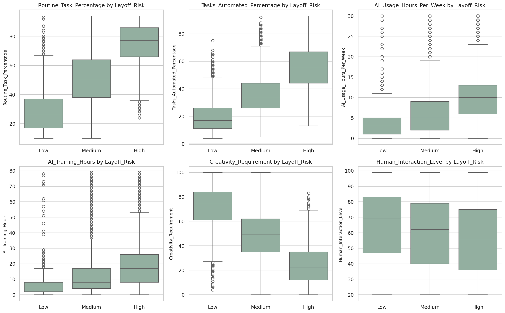

## 5. 多变量交叉分析

### 5.1 行业 × 岗位

行业内部的岗位结构进一步解释了高风险来源。高风险组合主要包括：

| 行业 | 岗位 | 样本数 | 高风险比例 |
|---|---|---:|---:|
| Manufacturing | Operator | 858 | 50.2% |
| Manufacturing | Production Supervisor | 806 | 48.3% |
| Manufacturing | Quality Engineer | 793 | 46.0% |
| Retail | Inventory Analyst | 857 | 44.6% |
| Logistics | Dispatcher | 788 | 42.1% |
| Logistics | Warehouse Manager | 843 | 41.3% |
| Logistics | Supply Chain Analyst | 857 | 41.2% |
| Retail | Sales Associate | 807 | 40.6% |

### 5.2 岗位级别 × AI 采用等级

岗位级别和 AI 采用等级存在明显交互。即使是高级岗位，在 AI 高采用环境中高风险比例也会上升；但相比初级岗位仍然具有缓冲。

| 岗位级别 | AI 采用等级 | 样本数 | 高风险比例 |
|---|---|---:|---:|
| Entry | High | 658 | 93.5% |
| Mid | High | 564 | 78.9% |
| Senior | High | 193 | 43.0% |
| Entry | Medium | 3,624 | 74.2% |
| Mid | Medium | 3,161 | 55.0% |
| Senior | Medium | 1,261 | 20.2% |
| Entry | Low | 4,734 | 15.0% |
| Mid | Low | 4,215 | 6.0% |
| Senior | Low | 1,590 | 0.7% |

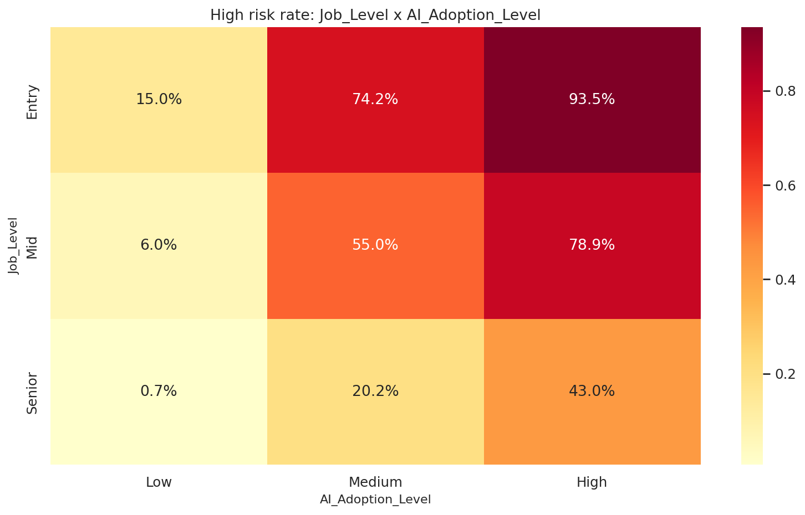

### 5.3 重复性任务 × 自动化比例

重复性任务比例和任务自动化比例叠加后，高风险比例快速上升。

| 重复性任务区间 | 自动化比例区间 | 样本数 | 高风险比例 |
|---|---|---:|---:|
| 0-25 | 0-25 | 3,751 | 0.0% |
| 26-50 | 26-50 | 3,144 | 9.3% |
| 51-75 | 26-50 | 3,851 | 37.5% |
| 51-75 | 51-75 | 1,943 | 66.2% |
| 76-100 | 26-50 | 1,183 | 72.1% |
| 76-100 | 51-75 | 2,400 | 85.5% |
| 76-100 | 76-100 | 846 | 94.9% |

当重复性任务比例和自动化比例同时进入高区间时，高风险比例接近 95%，这是最明确的高风险画像之一。

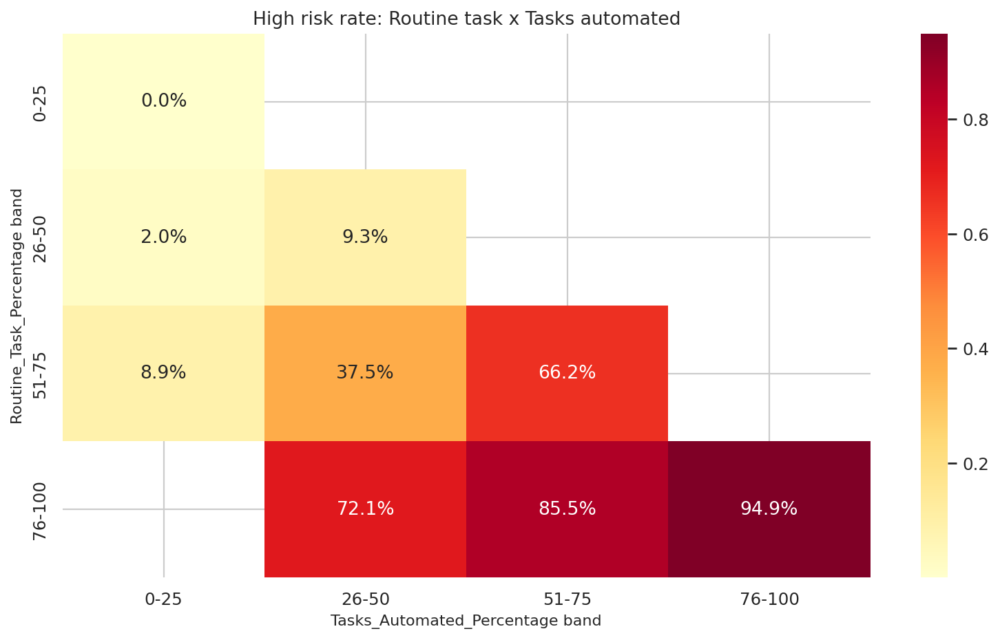

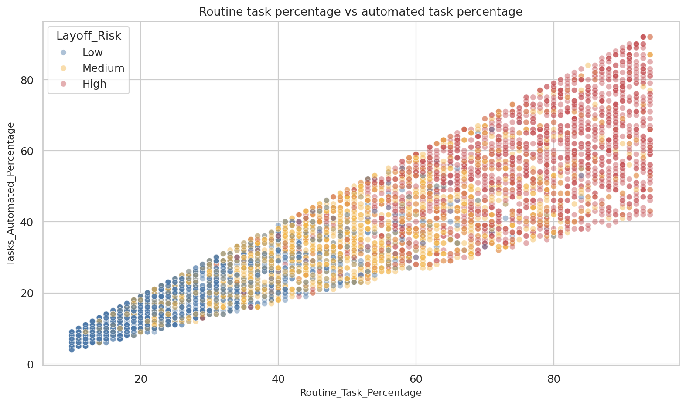

### 5.4 创造力要求 × 人际互动水平

创造力要求是重要保护因素，人际互动也有一定保护作用，两者叠加后高风险比例明显下降。

| 创造力要求 | 人际互动水平 | 样本数 | 高风险比例 |
|---|---|---:|---:|
| Low | Low | 1,105 | 86.6% |
| Low | Medium | 2,615 | 79.6% |
| Low | High | 2,873 | 67.0% |
| Medium | Low | 1,275 | 35.5% |
| Medium | Medium | 3,055 | 26.4% |
| Medium | High | 3,528 | 15.4% |
| High | Low | 877 | 1.3% |
| High | Medium | 2,178 | 0.7% |
| High | High | 2,494 | 0.2% |

高创造力要求几乎可以显著降低高风险概率，即使人际互动水平较低，高风险比例也只有 1.3%。

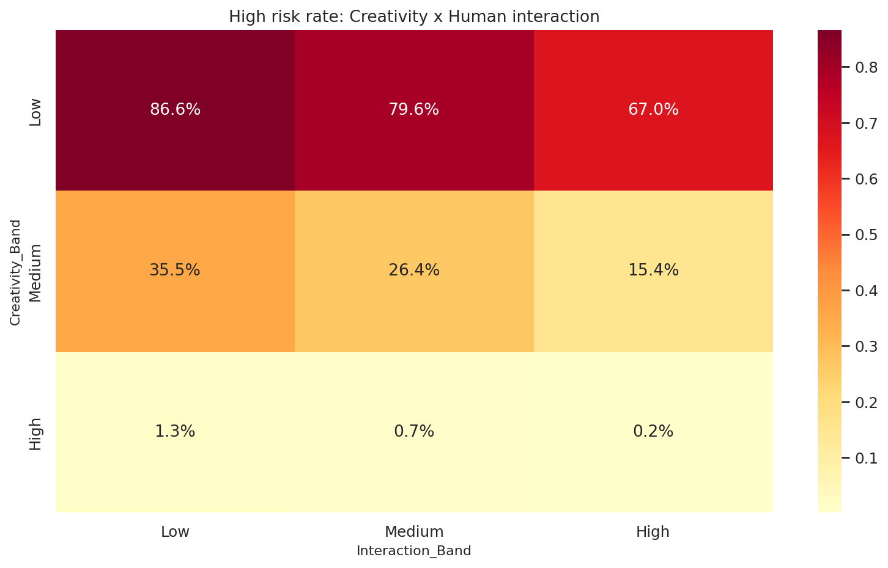

## 6. 特征工程

Notebook 构造了以下衍生变量，用于增强解释和建模：

| 衍生变量 | 含义 |
|---|---|
| `AI_Adoption_Score` | 将 AI 采用等级映射为数值分数 |
| `Job_Level_Score` | 将岗位级别映射为数值分数 |
| `Education_Score` | 将教育水平映射为数值分数 |
| `Company_Size_Score` | 将公司规模映射为数值分数 |
| `Automation_Exposure_Index` | 综合重复性任务、自动化比例和 AI 采用程度的自动化暴露指数 |
| `Human_Creative_Protection_Index` | 综合创造力要求和人际互动水平的人类能力保护指数 |
| `AI_Intensity_Index` | 综合 AI 工具数量、AI 使用小时和 AI 采用程度的 AI 使用强度指数 |
| `Experience_Band` | 工作经验分组 |
| `Age_Band` | 年龄分组 |
| `Risk_Binary` | 是否为高风险的二分类目标 |
| `Layoff_Risk_Score` | 风险等级数值编码 |

三个核心衍生指数在不同风险等级下的均值如下：

| 风险等级 | 自动化暴露指数 | 人类能力保护指数 | AI 使用强度指数 |
|---|---:|---:|---:|
| Low | 14.3 | 68.3 | 9.6 |
| Medium | 33.0 | 54.0 | 22.5 |
| High | 56.3 | 39.9 | 41.8 |

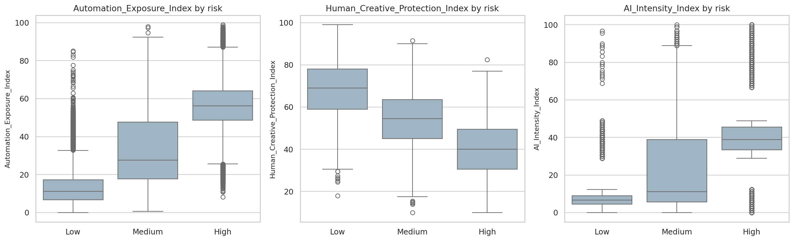

特征工程后的数据已保存至：

`analysis_outputs/ai_impact_jobs_layoff_risk_feature_engineered.csv`

## 7. 统计检验

### 7.1 类别变量卡方检验

类别变量使用卡方检验，并使用 Cramer's V 衡量关联强度。

| 特征 | p 值 | Cramer's V | 解释 |
|---|---:|---:|---|
| AI_Adoption_Level | 0.000 | 0.445 | 与风险关联最强 |
| Job_Level | 0.000 | 0.203 | 中等关联 |
| Job_Role | 0.000 | 0.176 | 有明显关联 |
| Industry | 0.000 | 0.170 | 有明显关联 |
| Education_Level | 0.000 | 0.122 | 有一定关联 |
| Company_Size | 0.096 | 0.014 | 统计关联较弱，不显著 |

结论：AI 采用等级、岗位级别、岗位角色、行业和教育水平与裁员风险显著相关；公司规模与风险之间的统计关联较弱。

### 7.2 数值变量 Kruskal-Wallis 检验

数值变量使用 Kruskal-Wallis 检验，并用 epsilon squared 衡量效应量。

| 特征 | epsilon squared | 解释 |
|---|---:|---|
| Routine_Task_Percentage | 0.610 | 极强差异 |
| Tasks_Automated_Percentage | 0.586 | 极强差异 |
| Automation_Exposure_Index | 0.578 | 极强差异 |
| Creativity_Requirement | 0.577 | 极强差异 |
| Human_Creative_Protection_Index | 0.459 | 强差异 |
| AI_Intensity_Index | 0.310 | 较强差异 |
| AI_Usage_Hours_Per_Week | 0.301 | 较强差异 |
| Number_of_AI_Tools_Used | 0.281 | 较强差异 |
| AI_Training_Hours | 0.247 | 中强差异 |
| Human_Interaction_Level | 0.026 | 较弱差异 |
| Years_of_Experience | 0.010 | 较弱差异 |
| Age | 0.001 | 很弱差异 |

结论：任务结构和自动化相关变量的效应量远高于年龄、经验等人口背景变量。

### 7.3 Spearman 相关性

与 `Layoff_Risk_Score` 相关性最高的正向变量包括：

| 特征 | Spearman 相关系数 |
|---|---:|
| Routine_Task_Percentage | 0.781 |
| Tasks_Automated_Percentage | 0.765 |
| Automation_Exposure_Index | 0.760 |
| AI_Adoption_Score | 0.622 |
| AI_Intensity_Index | 0.556 |
| AI_Usage_Hours_Per_Week | 0.547 |
| Number_of_AI_Tools_Used | 0.529 |
| AI_Training_Hours | 0.496 |

主要负向相关变量包括：

| 特征 | Spearman 相关系数 |
|---|---:|
| Creativity_Requirement | -0.760 |
| Human_Creative_Protection_Index | -0.677 |
| Job_Level_Score | -0.274 |
| Education_Score | -0.170 |
| Human_Interaction_Level | -0.160 |
| Years_of_Experience | -0.101 |

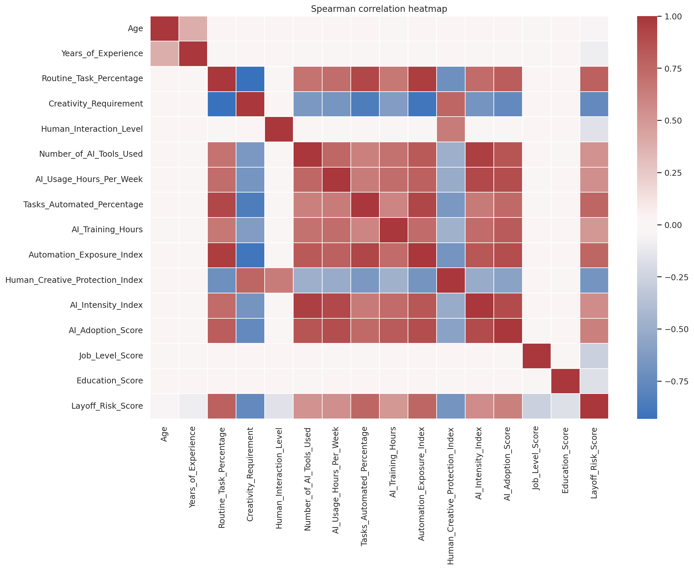

## 8. 预测建模

### 8.1 多分类裁员风险模型

目标：预测 `Layoff_Risk = Low / Medium / High`。  
数据划分：70% 训练集、30% 测试集，使用分层抽样保持目标类别比例。  
评估指标：Accuracy、Macro F1、Weighted F1。

| 模型 | Accuracy | Macro F1 | Weighted F1 |
|---|---:|---:|---:|
| Logistic Regression | 0.962 | 0.962 | 0.962 |
| LightGBM | 0.952 | 0.952 | 0.952 |
| XGBoost | 0.947 | 0.947 | 0.947 |
| Gradient Boosting | 0.913 | 0.913 | 0.913 |
| Random Forest | 0.885 | 0.885 | 0.886 |
| Decision Tree | 0.816 | 0.818 | 0.818 |

最佳模型为 Logistic Regression。测试集分类报告显示：

| 类别 | Precision | Recall | F1-score | Support |
|---|---:|---:|---:|---:|
| Low | 0.97 | 0.97 | 0.97 | 1,981 |
| Medium | 0.94 | 0.95 | 0.94 | 1,980 |
| High | 0.98 | 0.97 | 0.97 | 2,039 |
| Accuracy |  |  | 0.96 | 6,000 |

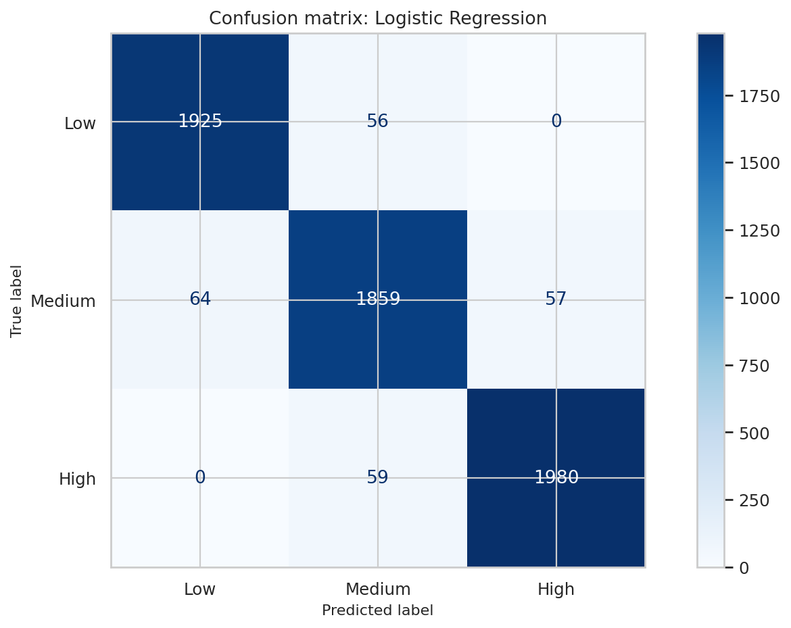

### 8.2 二分类高风险预警模型

目标：预测样本是否为 `High` 风险。  
业务重点：优先关注高风险召回率，避免漏报高风险岗位。

| 模型 | Accuracy | High Precision | High Recall | High F1 | ROC-AUC | PR-AUC |
|---|---:|---:|---:|---:|---:|---:|
| Logistic Regression | 0.980 | 0.961 | 0.982 | 0.971 | 0.998 | 0.997 |
| LightGBM | 0.977 | 0.955 | 0.976 | 0.966 | 0.998 | 0.996 |
| XGBoost | 0.974 | 0.949 | 0.977 | 0.963 | 0.998 | 0.996 |
| Gradient Boosting | 0.963 | 0.954 | 0.935 | 0.945 | 0.994 | 0.990 |
| Random Forest | 0.938 | 0.882 | 0.943 | 0.912 | 0.988 | 0.978 |

最佳高风险预警模型为 Logistic Regression。其对 `High` 类别的召回率为 0.982，说明模型能识别绝大多数高风险样本。

Notebook 还进行了阈值调整。当选择阈值 0.872 时：

| 阈值 | Precision | Recall | F1 |
|---:|---:|---:|---:|
| 0.872 | 0.989 | 0.901 | 0.943 |

阈值提高后，模型更保守，能提升高风险预测的精准率，但会牺牲召回率。实际应用中可根据“漏报成本”和“误报处理成本”选择阈值。

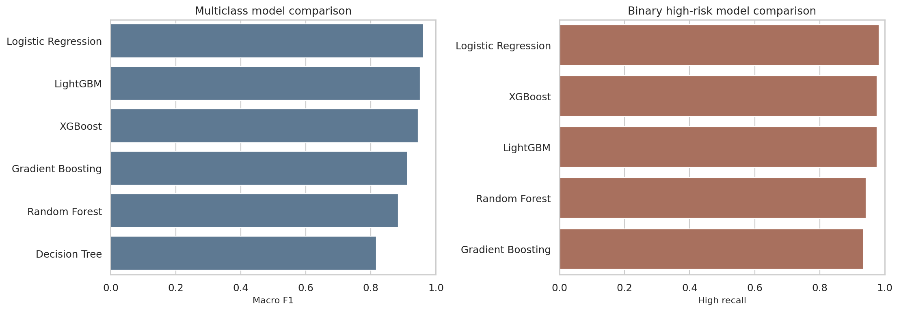

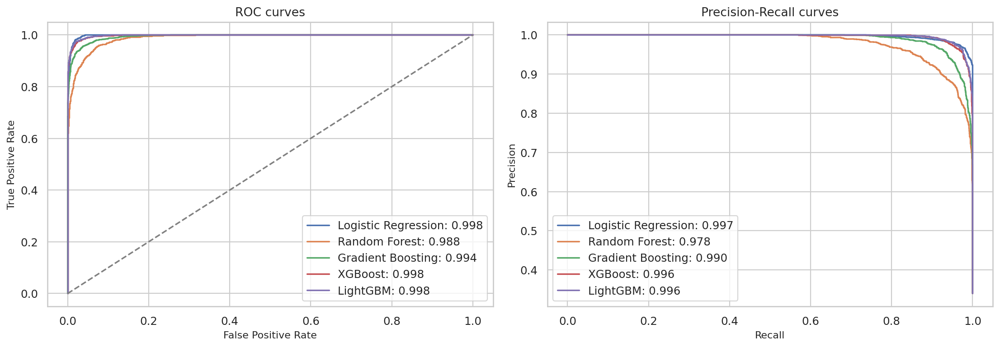

## 9. 模型解释

### 9.1 Permutation Importance

基于最佳多分类模型的 permutation importance，最重要的输入特征如下：

| 排名 | 特征 | 重要性均值 |
|---:|---|---:|
| 1 | Routine_Task_Percentage | 0.225 |
| 2 | Tasks_Automated_Percentage | 0.201 |
| 3 | Job_Level_Score | 0.180 |
| 4 | Industry | 0.128 |
| 5 | Education_Score | 0.102 |
| 6 | Human_Creative_Protection_Index | 0.083 |
| 7 | Automation_Exposure_Index | 0.078 |
| 8 | Creativity_Requirement | 0.078 |
| 9 | Experience_Band | 0.038 |
| 10 | Years_of_Experience | 0.036 |

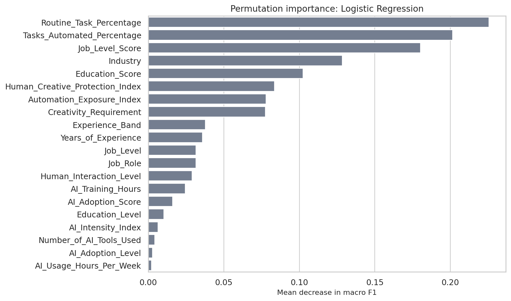

### 9.2 模型系数与树模型解释

多分类模型的系数重要性进一步显示，行业、重复性任务比例、岗位级别、自动化比例、教育水平等变量具有较强解释力。

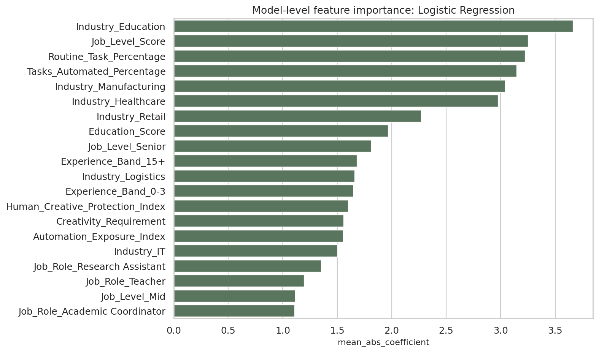

### 9.3 SHAP 高风险解释

Notebook 额外训练了 LightGBM 高风险二分类解释模型，并使用 SHAP 分析高风险预测。该解释模型表现如下：

| Accuracy | High Precision | High Recall | High F1 | ROC-AUC | PR-AUC |
|---:|---:|---:|---:|---:|---:|
| 0.977 | 0.955 | 0.976 | 0.966 | 0.998 | 0.996 |

SHAP 重要性排名靠前的变量如下：

| 排名 | 特征 | mean_abs_shap |
|---:|---|---:|
| 1 | Routine_Task_Percentage | 2.314 |
| 2 | Tasks_Automated_Percentage | 2.191 |
| 3 | Job_Level_Score | 1.666 |
| 4 | Human_Creative_Protection_Index | 1.502 |
| 5 | Education_Score | 0.992 |
| 6 | Years_of_Experience | 0.905 |
| 7 | Creativity_Requirement | 0.733 |
| 8 | Industry_Education | 0.497 |
| 9 | Industry_Manufacturing | 0.480 |
| 10 | Industry_Healthcare | 0.474 |

解释结论：

- 重复性任务比例和任务自动化比例是高风险预测的最核心变量。
- 岗位级别、教育水平、经验年限和创造力要求具有保护或分层作用。
- 行业变量重要，但其作用应结合岗位角色和任务结构共同解读。

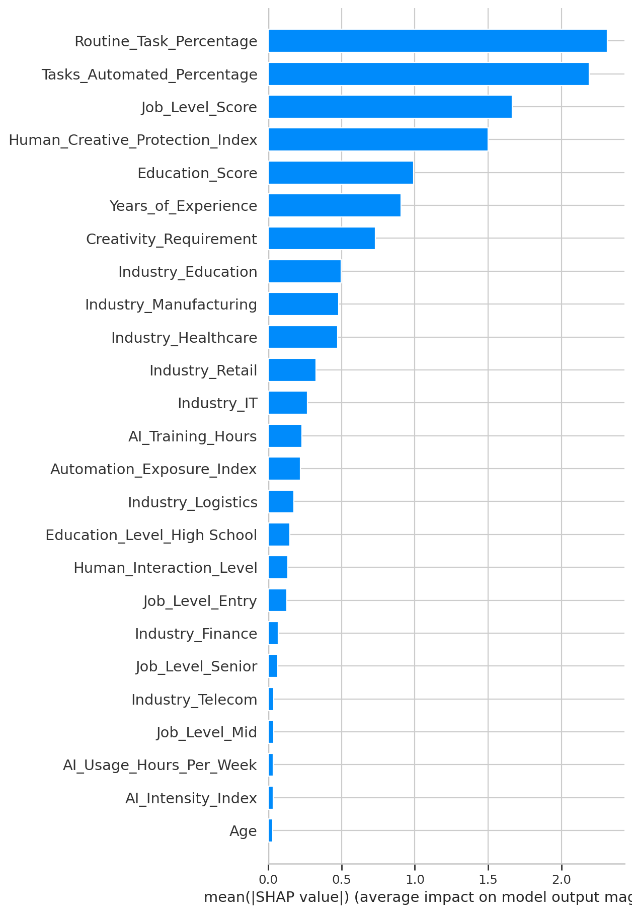

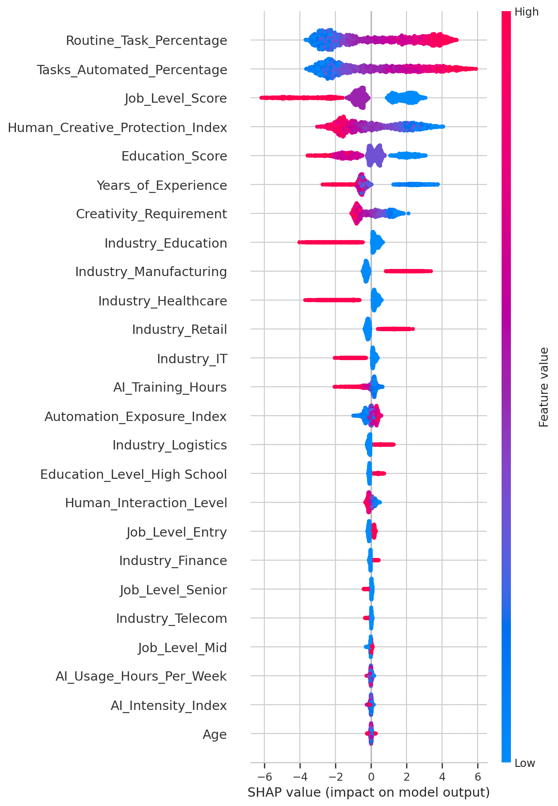

## 10. 聚类与人群分层

Notebook 在不使用 `Layoff_Risk` 的情况下，根据岗位任务、AI 使用、自动化、经验和岗位级别进行无监督聚类。KMeans 轮廓系数显示选择 2 个聚类较合适。

| Cluster | 样本数 | 高风险比例 | 自动化暴露均值 | 保护指数均值 | AI 强度均值 | 重复性任务均值 | 自动化比例均值 | 创造力均值 |
|---:|---:|---:|---:|---:|---:|---:|---:|---:|
| 0 | 9,307 | 62.8% | 57.0 | 43.1 | 45.7 | 73.0 | 52.7 | 26.7 |
| 1 | 10,693 | 8.9% | 15.3 | 63.3 | 6.6 | 33.5 | 23.8 | 66.2 |

群体画像：

| Cluster | 画像 | 高风险比例 | 主要行业 | 主要岗位 |
|---:|---|---:|---|---|
| 0 | 高风险、高自动化暴露、低创造力互动保护、高 AI 使用强度 | 62.8% | Finance、Manufacturing、Healthcare | Operator、Medical Assistant、Accountant |
| 1 | 低风险、低自动化暴露、高创造力互动保护、低 AI 使用强度 | 8.9% | Telecom、Healthcare、Retail | Nurse、Financial Analyst、Network Engineer |

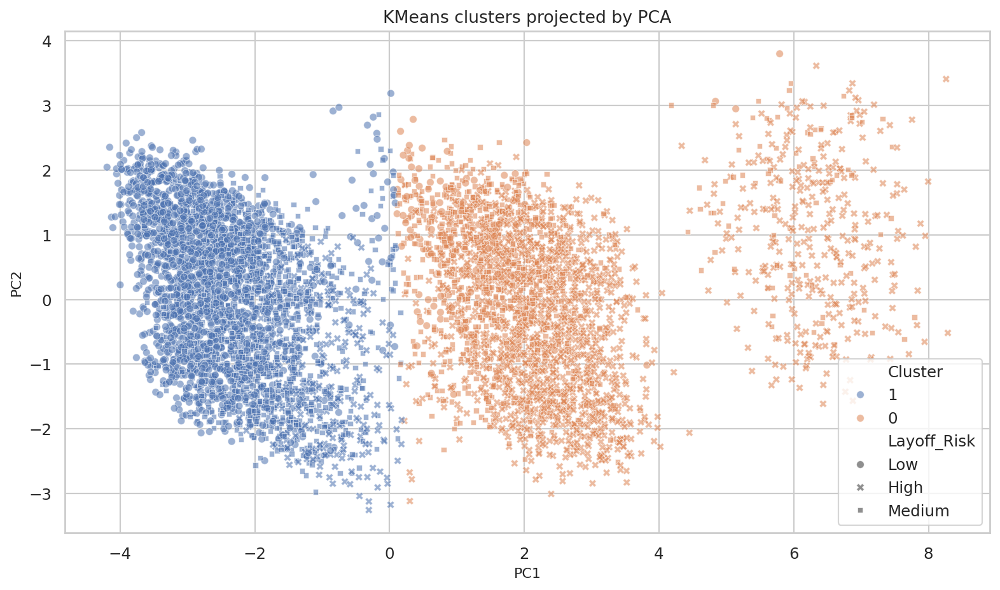

聚类结果说明：高风险并不只由行业标签决定，而是更清晰地表现为“岗位任务结构 + 自动化暴露 + AI 使用强度 + 保护性能力”的组合。

## 11. 业务洞察

### 11.1 高风险来源

裁员高风险的主要来源是岗位任务被标准化和自动化的程度。重复性任务比例越高、自动化比例越高、AI 使用强度越高，岗位进入高风险等级的概率越大。

### 11.2 保护性因素

创造力要求、人际互动、岗位级别、教育水平和经验年限对风险有不同程度的缓冲作用。其中创造力要求和人类能力保护指数的保护作用最明显。

### 11.3 AI 培训的解释边界

高风险组 AI 培训小时数更高，但这不应被解释为培训导致风险上升。更合理的业务解释是：高风险岗位更可能处于 AI 转型、流程改造或补救培训阶段，因此培训小时数和高风险同时出现。

### 11.4 公司规模不是主要解释因素

公司规模与裁员风险的卡方检验 p 值为 0.096，Cramer's V 仅 0.014，说明其解释力较弱。裁员风险更应从岗位任务结构和 AI 自动化暴露角度理解，而不是简单归因于公司规模。

## 12. 可操作建议

### 12.1 建立岗位高风险预警清单

优先关注以下组合：

- 制造、物流、零售等高风险行业。
- `Operator`、`Production Supervisor`、`Quality Engineer`、`Inventory Analyst`、`Dispatcher` 等高风险岗位。
- 重复性任务比例高于 75%、自动化比例高于 50% 的岗位。
- `AI_Adoption_Level = High` 且岗位级别为 `Entry` 或 `Mid` 的岗位。

### 12.2 将培训与岗位重设计绑定

仅增加 AI 培训小时数不足以降低风险。培训应与岗位重设计结合，重点提升：

- AI 输出判断与复核能力。
- 异常处理和流程改进能力。
- 跨职能沟通与业务解释能力。
- 数据分析、问题拆解和决策支持能力。
- 从执行型任务向监督、协调、优化型任务迁移的能力。

### 12.3 对初级岗位建立转型路径

`Entry` 岗位的高风险比例明显高于 `Mid` 和 `Senior`。建议为初级岗位设计明确的能力跃迁路径，例如从重复执行转向质量控制、客户沟通、数据标注与审核、AI 工作流运营、流程监控等方向。

### 12.4 将模型用于筛查，而非直接决策

二分类高风险预警模型具有较高召回率，可用于内部风险筛查。但模型结果不应直接作为裁员依据，应作为以下流程的输入：

1. 模型识别潜在高风险岗位。
2. 业务部门复核岗位实际职责和近期组织变化。
3. HR 与管理者评估培训、转岗、岗位重设计可能性。
4. 定期更新数据和模型，监测风险变化。

### 12.5 分层制定干预策略

对于 Cluster 0，应优先开展岗位重设计、自动化影响评估和技能迁移计划。对于 Cluster 1，可重点保持专业能力、人际互动能力和创造性任务占比，避免在 AI 应用过程中将岗位过度流程化。

## 13. 局限性

1. 本分析基于观察型数据，无法直接证明因果关系。
2. 数据集中未包含地区、薪酬、绩效、组织战略、业务增长/收缩、宏观经济等变量，这些因素也可能影响裁员风险。
3. AI 采用等级和 AI 使用强度可能同时受到岗位性质影响，存在反向解释可能。
4. 模型在当前数据集上表现较好，但上线前仍需使用真实业务数据进行外部验证。
5. 裁员风险属于敏感预测场景，模型应用必须引入人工复核、公平性评估和治理机制。

## 14. 结论

本次分析表明，AI 对岗位裁员风险的影响主要通过任务结构和自动化暴露体现。高重复性、高自动化、高 AI 使用强度、低创造力要求、低岗位级别构成了最典型的高风险画像。相反，创造力、人际互动、专业判断、经验积累和更高岗位级别能够降低岗位进入高风险等级的概率。

从管理实践看，企业不应仅以行业或公司规模判断风险，而应建立基于岗位任务结构的动态风险评估机制。对于高风险岗位，优先方向不是简单增加培训，而是通过岗位重设计、能力迁移和 AI 协同流程改造，降低可替代的重复性任务占比，提高员工在判断、协调、复核、创新和业务决策中的价值。

## 15. 附录：主要分析产出

关键表格位于 `analysis_outputs/tables/`，关键图表位于 `analysis_outputs/figures/`。

主要图表包括：

- `analysis_outputs/figures/target_distribution.png`
- `analysis_outputs/figures/numeric_distributions.png`
- `analysis_outputs/figures/key_category_distributions.png`
- `analysis_outputs/figures/high_risk_rates_industry_role.png`
- `analysis_outputs/figures/numeric_features_by_risk_boxplots.png`
- `analysis_outputs/figures/job_level_ai_adoption_high_risk_heatmap.png`
- `analysis_outputs/figures/routine_automation_high_risk_heatmap.png`
- `analysis_outputs/figures/creativity_interaction_high_risk_heatmap.png`
- `analysis_outputs/figures/spearman_correlation_heatmap.png`
- `analysis_outputs/figures/multiclass_confusion_matrix.png`
- `analysis_outputs/figures/binary_roc_pr_curves.png`
- `analysis_outputs/figures/permutation_importance_multiclass.png`
- `analysis_outputs/figures/shap_high_risk_bar.png`
- `analysis_outputs/figures/shap_high_risk_summary.png`
- `analysis_outputs/figures/cluster_pca_scatter.png`
